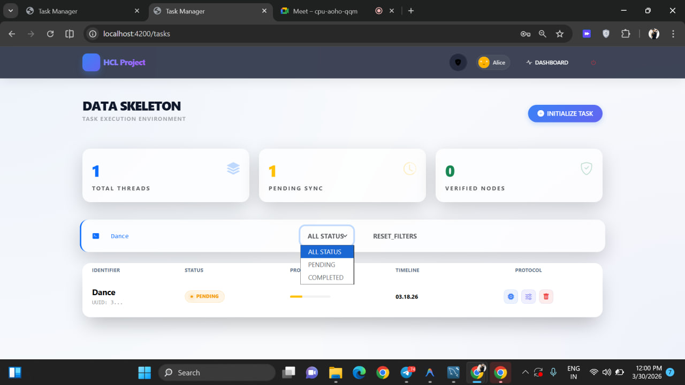

# HCL Task Manager Project

A enterprise-grade full-stack task management application featuring a high-tech Angular frontend, a robust .NET Web API backend, and an integrated MVC Razor version.

## What This Project Does

This project provides a comprehensive task management ecosystem:

- **User Authentication**: Secure registration and login using JWT (JSON Web Tokens).
- **Core Task Operations**: Complete CRUD (Create, Read, Update, Delete) functionality for personal tasks.
- **Dynamic UI**: A high-tech frontend with glassmorphism, smooth entry animations, and a real-time dark/light mode toggle.
- **Dual Performance**: Optimized both as a standalone SPA (Angular) and a traditional server-side MVC application.
- **Data Governance**: Secure persistence using MySQL with Entity Framework Core.
- **Responsive Management**: Filter tasks by status, search by identifier, and track execution progress.

### Tech Stack

- **Backend (API)**: ASP.NET Core (`net10.0`), EF Core (Pomelo MySQL), JWT Bearer Auth, BCrypt Hashing.
- **Backend (MVC)**: ASP.NET Core MVC with Razor Pages for server-side rendering.
- **Frontend**: Angular 17+ with Standalone Components, Reactive Forms, and advanced CSS Animations.
- **Database**: MySQL.

## Why It Is Useful

- **Hybrid Architecture**: Demonstrates integration of a modern SPA with a traditional MVC frontend sharing a single API.
- **Enterprise Aesthetics**: Features a "High-Tech" design system with staggered load animations and premium dark mode.
- **Ready-to-Use Auth**: Includes a pre-configured auth flow with token management and protected routing.
- **Clean Codebase**: Adheres to SOLID principles with clear separation of concerns (Controllers, Services, Repositories).

## How To Get Started

### Prerequisites

- Node.js 20+ and npm
- .NET SDK 10
- MySQL Server (default port: 3306)

### 1. Database Setup

Ensure your MySQL server is running and create the database:

```sql
CREATE DATABASE task_management_db;
```

Update the connection string in `backend/TaskManagerApi/appsettings.json`:

```json
"DefaultConnection": "Server=localhost;Port=3306;Database=task_management_db;User=root;Password=YOUR_PASSWORD;"
```

### 2. Run the Backend API

```bash
cd backend/TaskManagerApi
dotnet restore
dotnet run
```

The API will be available at: `http://localhost:5000`

### 3. Run the Frontend (Angular)

```bash
cd frontend/task-manager
npm install
npm start
```

Access the modern UI at: `http://localhost:4200`

### 4. Run the MVC Version (Optional)

```bash
cd backend/TaskManagerMvc
dotnet run
```

Access the classic Razor UI at: `http://localhost:51815`

## API Overview

**Auth Endpoints:**
- `POST /api/auth/register`
- `POST /api/auth/login`

**Task Endpoints (Auth Required):**
- `GET /api/tasks` - List all threads
- `POST /api/tasks` - Deploy new task
- `PUT /api/tasks/{id}` - Re-configure existing task
- `DELETE /api/tasks/{id}` - Terminate process

## Screenshots

### 🔐 Login Page


### ➕ Initialize New Task


### ⚙️ MVC Server Side


### 🗄️ MySQL Database


### 📊 Task Status


### 🎨 Theme Button


### 🔄 Toggle Status


## Project Structure

```text
TaskManagerSolution/
├─ backend/
│  ├─ TaskManagerApi/  # .NET Core 10 Web API (Core logic & DB access)
│  └─ TaskManagerMvc/  # ASP.NET Core MVC (Razor Pages version)
├─ frontend/
│  └─ task-manager/    # Angular standalone application (Enterprise UI)
```

## Maintainers And Contributions

This project is part of the **HCL Project Initiative**. Maintainers focus on delivering highly animated, enterprise-grade task management solutions.

- Before contributing, ensure all builds are passing:
  `dotnet build` and `npm run build`
